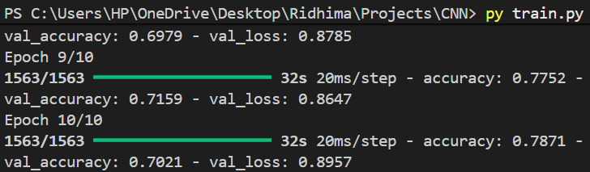

# CNN Image Classifier

This project implements a Convolutional Neural Network (CNN) for image classification using the CIFAR-10 dataset.

## Dataset
CIFAR-10 consists of 60,000 color images of size 32x32 belonging to 10 classes:
airplane, automobile, bird, cat, deer, dog, frog, horse, ship, truck.

## Technologies Used
- Python
- TensorFlow / Keras
- NumPy
- Matplotlib

## Model Architecture
- Convolution + ReLU
- Max Pooling
- Fully Connected layers
- Softmax output layer

## Results
Achieved approximately 70–75% validation accuracy on CIFAR-10.
